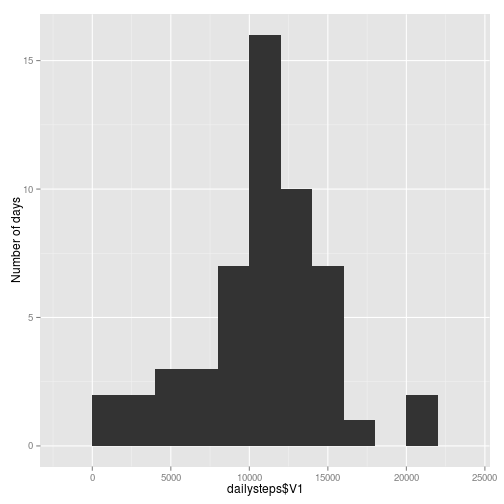
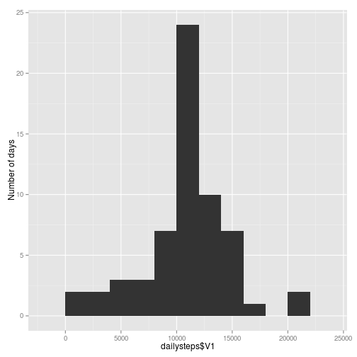
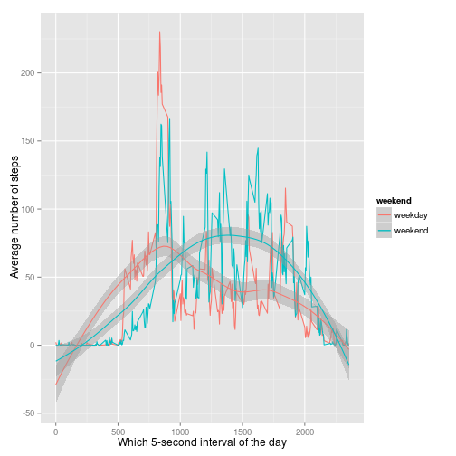
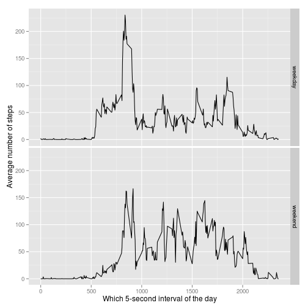

## Introduction


This study makes use of data from a personal activity monitoring device
which recorded every footstep taken by an anonymous person.
This device collected data at 5 minute intervals through out the day. Interval
value 500 is 5:00 a.m for example. The data consists of two months of data.

## Loading and processing the data
Load the data frame from CSV file:

```r
library(sqldf)
library(data.table)
library(ggplot2)
library(tcltk)
df <- read.csv('activity.csv')
summary(df)
```

```
##      steps               date          interval   
##  Min.   :  0.0   2012-10-01:  288   Min.   :   0  
##  1st Qu.:  0.0   2012-10-02:  288   1st Qu.: 589  
##  Median :  0.0   2012-10-03:  288   Median :1178  
##  Mean   : 37.4   2012-10-04:  288   Mean   :1178  
##  3rd Qu.: 12.0   2012-10-05:  288   3rd Qu.:1766  
##  Max.   :806.0   2012-10-06:  288   Max.   :2355  
##  NA's   :2304    (Other)   :15840
```

```r
str(df)
```

```
## 'data.frame':	17568 obs. of  3 variables:
##  $ steps   : int  NA NA NA NA NA NA NA NA NA NA ...
##  $ date    : Factor w/ 61 levels "2012-10-01","2012-10-02",..: 1 1 1 1 1 1 1 1 1 1 ...
##  $ interval: int  0 5 10 15 20 25 30 35 40 45 ...
```
Remove rows containing missing values:

```r
ok <- complete.cases(df)
x <- df[ok,]
dim(df)
```

```
## [1] 17568     3
```

```r
dim(x)
```

```
## [1] 15264     3
```

```r
df <- x
```

## Mean total number of steps taken per day

Computing mean and median of total number of steps per day:

```r
dt <- data.table(df)
dailysteps <- dt[,sum(steps),by=date]
mn <- mean(dailysteps$V1)
md <- median(dailysteps$V1)
```
Excluding incomplete observations, the total number of steps per day mean is
10766.1887 and median is 10765.

Histogram of the total number of steps taken each day:

```r
qplot(dailysteps$V1,binwidth=2000, ylab='Number of days')
```

 

## Average daily activity pattern

Time series plot (i.e. type = "l") of the 5-second interval (x-axis) and the
average number of steps taken, averaged across all days (y-axis):

```r
avgsteps <- dt[, mean(steps), by=interval]
plot(avgsteps$interval, avgsteps$V1, type='l',
     xlab='Which 5-second interval of a day (500 is 5:00 a.m.)',
     ylab='Average steps taken')
```

 

Which 5-second interval, on average across all the days in the dataset, contains
the maximum number of steps?


```r
max(avgsteps$V1)
```

```
## [1] 206.2
```

```r
themax <- avgsteps[which(max(V1)==V1)]
print(themax)
```

```
##    interval    V1
## 1:      835 206.2
```
The answer is interval 835, which agrees with the location of
the big spike on the time series plot above.

## Imputing missing values

This section imputes missing values by replacing values of NA with **interval means.**
It finds the rows having missing values.
It finds means of intervals by looking at the rows where nothing was missing.
It makes a new data frame by substituting the imputed mean values of steps into
the rows that had missing values.
It row-binds (unions) the good rows and the imputed rows together again.
It computes a new daily sum of steps on the re-unioned rows.
It shows the histogram of the new daily sum of steps.

```r
df <- read.csv('activity.csv')
dt <- data.table(df)
ok <- complete.cases(dt); #print(head(ok))
okdt <- dt[ok==TRUE,]; #print(dim(okdt))
baddt <- dt[ok==FALSE,]; #print(dim(baddt))
avgsteps <- okdt[, mean(steps), by=interval]
sqlexpr <- paste('select avgsteps.V1 as steps, baddt.date, baddt.interval ',
                 'from avgsteps, baddt ',
                 'where avgsteps.interval = baddt.interval', sep='')
fixeddt <- sqldf(sqlexpr)
reunioned <- data.table(rbind(okdt, fixeddt))
dailysteps <- reunioned[, sum(steps), by=date] # recompute on all obs together.
mni <- mean(dailysteps$V1); #print(mn)
mdi <- median(dailysteps$V1); #print(md)
qplot(dailysteps$V1, binwidth=2000, ylab='Number of days')
```

 

When including imputed values instead of skipping the cases having missing data,
the total number of steps per day mean is 10749.7705 and median is 10641.
Compared to the same computations made on complete cases only, the mean changed
by -16.4182, and median by -124.

The impact of imputing missing data on the estimates of the total daily number
of steps is, when the change expressed as a percentage, -0.1525 for
the mean and -1.1519 for the median.  There was a large growth in
height of the mode or highest bar in the histogram, which was about 15 frequency
then it became about 25 frequency after imputation. The other bars heights were
unchanged. The imputation assigned mean values where there had been missing
values, so a taller center bar makes good sense on the histogram of the imputed
data set.

## Differences in activity patterns between weekdays and weekends

Below is a graphic which I am adding, above and beyond the project requirement.
It overlays the weekend and weekday curve.  In my opinion, this graphic most
effectively highlights where the weekday and weekend curves differ from each
other. Weekends have the most steps in the afternoon. Weekdays have the most
steps happening in the morning.


```r
iswe <- weekdays(as.Date(reunioned$date)) %in% c('Saturday', 'Sunday')
w <- ifelse(iswe, 'weekend', 'weekday')
reunioned$weekend <- as.factor(w);
dt <- data.table(reunioned)
avgsteps <- dt[, mean(steps), by=list(weekend,interval)]; #print (avgsteps)
qplot(interval, V1, color=weekend, data=avgsteps, geom=c('line', 'smooth'),
      method='loess',
      xlab='Which 5-second interval of the day', ylab='Average number of steps')
```

 

Below is the project required graphic. It puts the weekend and weekday curves
each into its own graph.


```r
qplot(interval, V1, facets=weekend~., data=avgsteps, geom=c('line'),
      xlab='Which 5-second interval of the day', ylab='Average number of steps')
```

 

